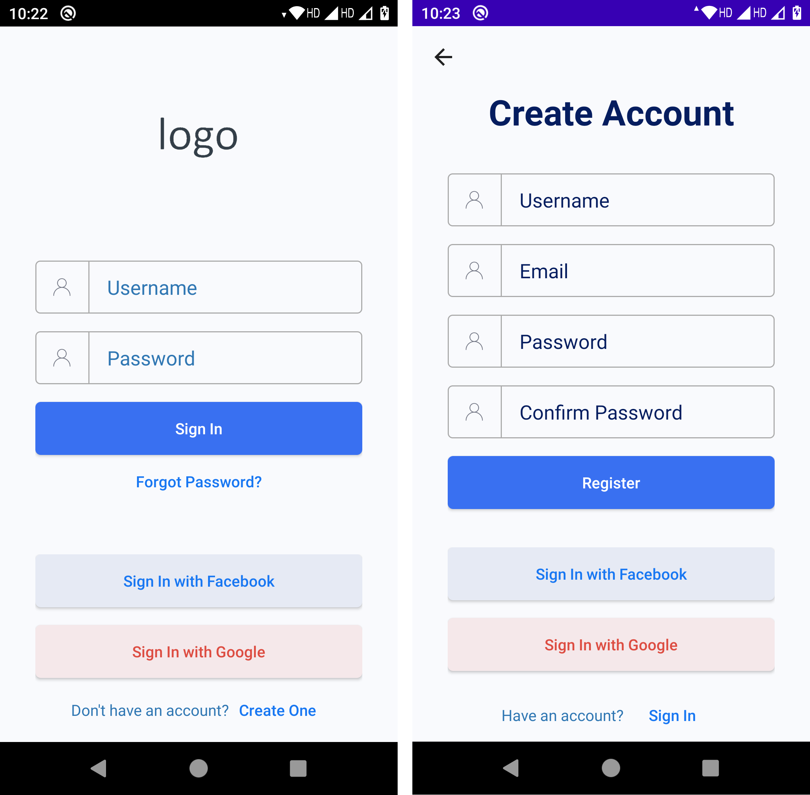

# 
SARVA Yoga - Frontend Technical Exercise

## Features Completed

- UI as per requirements
- MVVM Architecture 
- Firebase user registration
- Firebase login
- Facebook login
- Log out (firebase, fb)
- Simple form validation (Checking all fields for correctness and only one error)
- UI navigation if user is already logged in and other use cases

Note: fb login will work only after adding key hash to fb account. Firebase login requires google-services.json file.

## Features that can be added with extra time

- Google login
- Custom icons for form fields and buttons
- Custom validation messages for all form fields
- Firebase, facebook login error handling
- Crashlytics for reporting crashes
- localization and dark mode support
- Firebase user is created with email and password for time being. Custom user fields can be added.

## Screenshots

